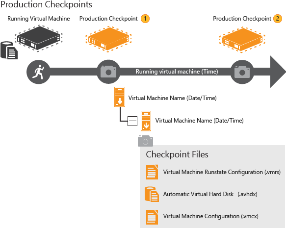

# Introduction to Hyper-V on Windows 10

Whether you are a software developer, an ITPro, or a tech enthusiast, many of you need to run multiple operating systems, occasionally on many different machines. Not all of us have access to a full suite of labs to house all these machines, and so virtualization can be a space and time saver. 

This is a new sentence.

Here is a diagram:

## Uses for virtualization
Virtualization enables anyone to easily maintain multiple test environments consisting of many operating systems, software configurations, and hardware configurations.  Hyper-V provides virtualization on Windows as well as a simple mechanism to quickly switch between these environments without incurring additional hardware costs.    

Hyper-V can be used in many ways, for example:
- A test environment consisting of multiple virtual machines can be created on a single desktop or laptop computer. Once testing has completed, these virtual machines can be exported and then imported into any other Hyper-V system.

- Developers can use Hyper-V on their computer to test software on multiple operating systems. For example, if you have an application that must be tested on Windows 8, Windows 7 and a Linux operating system, multiple virtual machines can be created on your development system, one containing each of these operating systems.

- You can use Hyper-V to troubleshoot virtual machines from any Hyper-V deployment. You can export a virtual machine from your production environment, open it on your desktop running Hyper-V, perform your required troubleshooting, and then export it back into the production environment. 

- Using virtual networking, you can create a multi-machine environment for test/development/demonstration that is secure from affecting the production network.

- Enthusiasts can use it to experiment with other operating systems. Hyper-V makes it very easy to bring up and tear down different operating systems.

- You can use Hyper-V on a laptop for demonstrating older versions of Windows or non-Windows operating systems. 

## System requirements

Hyper-V requires a 64-bit system that has Second Level Address Translation (SLAT). SLAT is a feature present in the current generation of 64-bit processors by Intel & AMD. You’ll also need a 64-bit version of Windows 8 or greater, and at least 4GB of RAM. Hyper-V does support creation of both 32-bit and 64-bit operating systems in the VMs.

Hyper-V’s dynamic memory allows memory needed by the VM to be allocated and de-allocated dynamically (you specify a minimum and maximum) and share unused memory between VMs. You can run 3 or 4 VMs on a machine that has 4GB of RAM but you'll need more RAM for 5 or more VMs. On the other end of the spectrum, you can also create large VMs with 32 processors and 512GB RAM, depending on your physical hardware.

## Operating systems you can run in a virtual machine ##

The term "guest" refers to a virtual machine and "host" refers to the computer running the virtual machine. Hyper-V on Windows supports many different guest operating systems including various releases of Linux, FreeBSD and Windows. For information about which operating systems are supported as guests in Hyper-V on Windows, see [Supported Windows Guest Operating Systems](supported_guest_os.md) and [Linux and FreeBSD Virtual Machines on Hyper-V](https://technet.microsoft.com/library/dn531030.aspx). 

## Differences between Hyper-V on Windows and Hyper-V on Windows Server
There are some features that work differently in Hyper-V on Windows than they do Hyper-V running on Windows Server. These include the following:

- The memory management model is different for Hyper-V on Windows. On a server, Hyper-V memory is managed with the assumption that only the virtual machines are running on the server. In Hyper-V on Windows, memory is managed with the understanding most client machines are running software in addition to running virtual machines. For example, a developer might be running Visual Studio as well as several virtual machines on the same computer.

- SR-IOV on a 64-bit guest works normally, but 32-bit does not and is not supported.

### Windows Server features not avilable in Windows Hyper-V
There are some features included in Hyper-V on server that are not included in Hyper-V on Windows. These include the following:

- The Remote FX capability to virtualize GPUs 

- Live migration of virtual machines from one host to another

- Hyper-V Replica

- Virtual Fibre Channel

- SR-IOV networking

- Shared .VHDX

> **Warning**: Virtual machines running on Hyper-V do not automatically handle moving from a wired to a wireless connection. You must change the virtual machines network adapter settings manually.

## Limitations
Using virtualization does have limitations. Features or applications that depend on specific hardware will not work well in a VM. For example, games or applications that require processing with GPUs (without providing software fallback) might not work well. Also, applications relying on sub 10ms timers, like latency-sensitive high-precision apps such as live music mixing apps, etc. could have issues running in a VM. The root OS is also running on top of the Hyper-V virtualization layer, but it is special in that it has direct access to all the hardware. This is why applications with special hardware requirements continue to work unhindered in the root OS but latency-sensitive, high-precision apps could still have issues running in the root OS.

As a reminder, you'll need to have a valid license for any operating systems you use in the VMs test.

## Next step: 
[Walkthrough Hyper-V on Windows 10](..\quick_start\walkthrough.md) 

Check out [What's New](whats_new.md) in Hyper-V on Windows 10.

